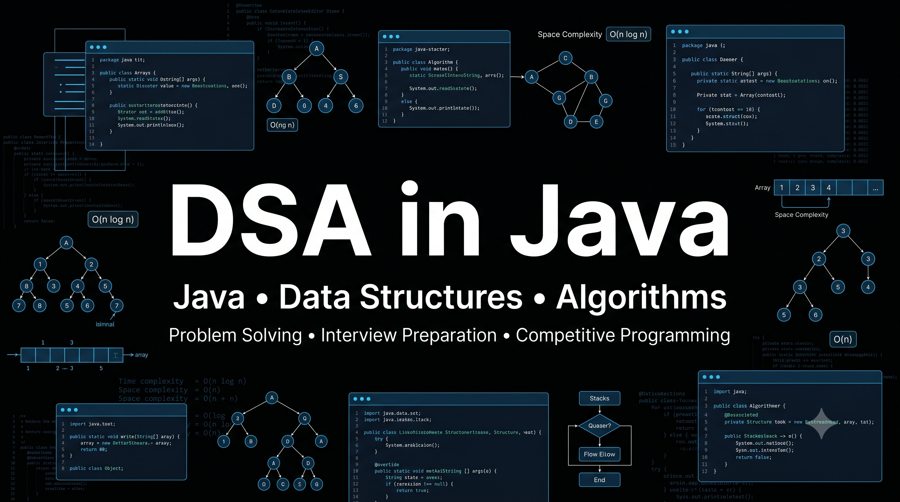

# Java DSA Journey

This repository documents my journey of learning Java, Object-Oriented Programming, Data Structures, Algorithms, and Problem Solving.

The repository is organized topic-wise to reflect my learning progression from Java Fundamentals to advanced DSA concepts.

---

## Repository Structure

### 01 - Java Fundamentals

Topics Covered:

* Variables
* Data Types
* Operators
* Type Casting
* Scanner Input
* Conditional Statements
* Switch Statements
* Ternary Operator
* Methods

---

### 02 - Loops

Topics Covered:

* For Loop
* While Loop
* Do While Loop
* Nested Loops
* Loop-Based Problem Solving

---

### 03 - Number Theory

Topics Covered:

* Prime Number
* Armstrong Number
* Strong Number
* Perfect Number
* Harshad Number
* Spy Number
* Automorphic Number
* Disarium Number
* Palindrome Number
* Digit-Based Problems
* Factor-Based Problems

---

### 04 - Pattern Printing

Topics Covered:

#### Recursive Patterns

* Pattern Printing using Recursion

#### Loop Based Patterns

* Star Patterns
* Number Patterns
* Pyramid Patterns
* Diamond Patterns
* Hollow Patterns

---

### 05 - Object-Oriented Programming (OOPs)

Topics Covered:

* Classes and Objects
* Methods in Classes
* Initialization
* Constructors
* Constructor Overloading
* Constructor Chaining
* Access Modifiers
* Encapsulation
* Static Keyword
* Final Keyword
* Inheritance
* Polymorphism
* Practice Questions

---

### 06 - Recursion

Topics Covered:

* Basic Recursion
* Recursive Mathematical Problems
* Recursive Number Theory Problems
* Recursive Thinking and Problem Decomposition

---

### 07 - Arrays

Topics Covered:

* Array Basics
* Traversal
* Insertion
* Deletion
* Searching
* Maximum and Minimum Element
* Second Largest Element
* Third Largest Element
* Array Rotations
* Problem Solving Using Arrays

(Currently Learning)

---

## Learning Philosophy

This repository is maintained incrementally as I learn new concepts and solve problems.

Instead of uploading solutions in bulk, topics and problems are added progressively to reflect actual learning and practice.

---

## Technologies

* Java
* Object-Oriented Programming
* Data Structures
* Algorithms

---

## Related Repositories

### Java Banking System

A separate repository demonstrating:

* Encapsulation
* Inheritance
* Abstraction
* Polymorphism
* Object-Oriented Design

Repository:
java-banking-system

---

## Future Topics

Planned topics include:

* Strings
* Searching
* Linked List
* Stack
* Queue
* Hashing
* Trees
* BST
* Heap
* Graphs
* Dynamic Programming
* Backtracking
* Greedy Algorithms
* Sliding Window
* Two Pointers
* Advanced Problem Solving

---

## Author

Vaikunth Prajapati

Computer Science Student | Java | DSA | MERN | AI/ML
